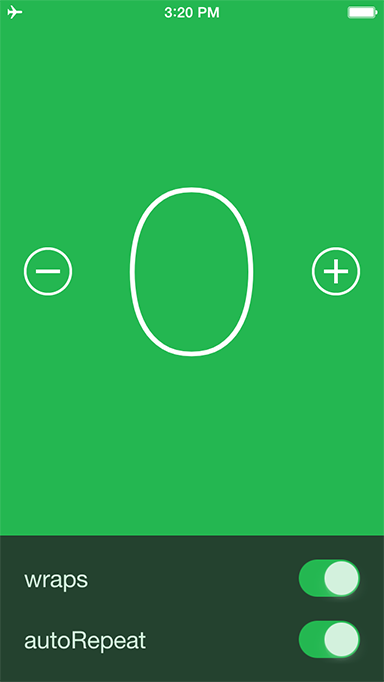
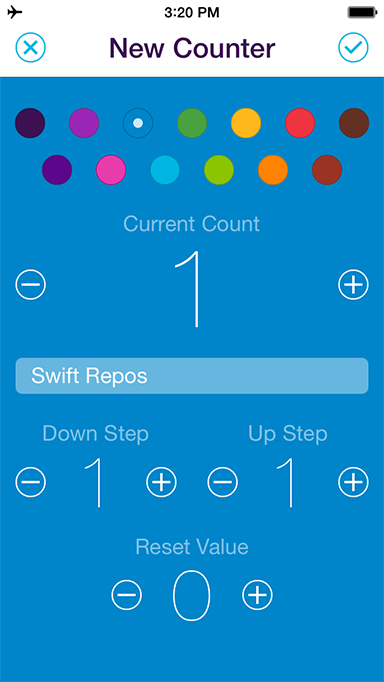

# KWStepper

KWStepper is a stepper control written in Swift. Unlike [UIStepper](https://developer.apple.com/library/ios/documentation/UIKit/Reference/UIStepper_Class/index.html), KWStepper allows for a fully customized UI and provides optional delegate methods for tailoring the UX.




 KWStepper was initially created in Objective-C for [Addo Label's](http://addolabel.com/) [Counters•](https://itunes.apple.com/app/id722416562?mt=8) and is now available in Swift for you to enjoy :)

## Installation

KWStepper is available on [CocoaPods](http://cocoapods.org). Alternatively, copy the files in the `KWStepper` directory into your project.

## Usage

Try the demo!

```swift
var stepper: KWStepper?

@IBOutlet weak var countLabel: UILabel!
@IBOutlet weak var decrementButton: UIButton!
@IBOutlet weak var incrementButton: UIButton!
```

```swift
self.stepper = KWStepper(
    decrementButton: self.decrementButton,
    incrementButton: self.incrementButton)

if let stepper = self.stepper {
    stepper.addTarget(self,
        action: Selector("stepperDidChange"),
        forControlEvents: .ValueChanged)
}
```

```swift
func stepperDidChange() {
    self.countLabel.text = NSString(format: "%.f", self.stepper!.value)
}
```

### Properties

The properties of KWStepper are identical to [UIStepper](https://developer.apple.com/library/ios/documentation/UIKit/Reference/UIStepper_Class/index.html) with the following exceptions:

* Instead of a single `stepValue` property, KWStepper provides `decrementStepValue` and `incrementStepValue` properties for setting different decrement and increment steps.
* There is a `delegate` property that should be set when adhering to the [`KWStepperDelegate`](#kwstepperdelegate) protocol.
* During user interaction, change events are sent immediately when the value changes–there is no `continuous` property. 

### KWStepperDelegate

Adopting `KWStepperDelegate` provides the following optional delegate methods for tailoring the UX.

* `optional func KWStepperDidDecrement()`
* `optional func KWStepperDidIncrement()`
* `optional func KWStepperMaxValueClamped()`
* `optional func KWStepperMinValueClamped()`

In the demo, `KWStepperMaxValueClamped()` and `KWStepperMinValueClamped()` are used to show a `UIAlertView` when a limit is reached and the `wraps` property is set to `false`.

In [Counters•](https://itunes.apple.com/app/id722416562?mt=8), `KWStepperDidDecrement()` and `KWStepperDidIncrement()` are used to play different sounds when decrementing and incrementing the steppers.

## Author

KWStepper was written by Kyle Weiner.

## License

KWStepper is available under the MIT license. See the LICENSE file for details.
