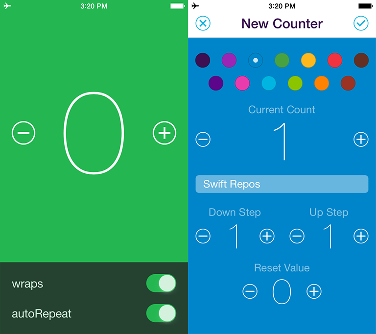

# KWStepper

[](http://cocoapods.org/?q=kwstepper)
[](https://github.com/Carthage/Carthage)
[](http://cocoadocs.org/docsets/KWStepper)
[](http://cocoapods.org/?q=kwstepper)
[](https://raw.githubusercontent.com/kyleweiner/KWStepper/master/LICENSE)

KWStepper is a stepper control written in Swift. Unlike [UIStepper](https://developer.apple.com/library/ios/documentation/UIKit/Reference/UIStepper_Class/index.html), KWStepper allows for a fully customized UI and provides callbacks for tailoring the UX.

<p align="center">

</p>

KWStepper was initially created in Objective-C for [Addo Label's](http://addolabel.com/) [Counters•](http://addolabel.com/counters) and is now available in Swift for you to enjoy :grin:

## Features

* Allows for a fully customized UI.
* Provides properties for setting different decrement and increment steps.
* Offers optional callbacks for responding to control events and tailoring the UX.
* Supports method chaining for easier configuration and event handling.

## Installation

### CocoaPods

KWStepper is available through [CocoaPods](http://cocoapods.org). To install
it, simply add the following lines to your `Podfile`:

```ruby
platform :ios, '8.0'
use_frameworks!

pod 'KWStepper'
```

### Carthage

To integrate KWStepper using [Carthage](https://github.com/Carthage/Carthage), add the following line to you `Cartfile`:

```ogdl
github "kyleweiner/KWStepper"
```

### Manually

If you prefer not to use a dependency manager, simply copy the [source files](https://github.com/kyleweiner/KWStepper/tree/master/Source) into your project.

## Usage

Try the example project!

```swift
var stepper: KWStepper!

@IBOutlet weak var countLabel: UILabel!
@IBOutlet weak var decrementButton: UIButton!
@IBOutlet weak var incrementButton: UIButton!
```

```swift
stepper = KWStepper(decrementButton: decrementButton, incrementButton: incrementButton)
```

Respond to control events using the `valueChangedCallback` property.

```swift
stepper.valueChangedCallback = { stepper in
    self.countLabel.text = String(stepper.value)
}
```

Or, use the target-action pattern.

```swift
stepper.addTarget(self, action: #selector(stepperDidChange), for: .valueChanged)
```

### Configuring KWStepper

With the exception of the `continuous` property, KWStepper offers everything provided by [UIStepper](https://developer.apple.com/library/ios/documentation/UIKit/Reference/UIStepper_Class/index.html) and more.

```swift
stepper.autoRepeat = true
stepper.autoRepeatInterval = 0.10
stepper.wraps = true
stepper.minimumValue = 0
stepper.maximumValue = 8
stepper.value = 0
stepper.incrementStepValue = 1
stepper.decrementStepValue = 1
```

Method chaining is also supported:

```swift
stepper
    .wraps(true)
    .maximumValue(10)
    .stepValue(2)
    .valueChanged { stepper in
        // ...
    }
```

If necessary, the rounding behavior for incrementing and decrementing may be modified via `roundingBehavior`.

### KWStepperDelegate

Adopting `KWStepperDelegate` provides the following optional delegate methods for tailoring the UX.

* `optional func KWStepperDidDecrement()`
* `optional func KWStepperDidIncrement()`
* `optional func KWStepperMaxValueClamped()`
* `optional func KWStepperMinValueClamped()`
* `optional func KWStepperDidEndLongPress()`

### Callbacks

KWStepper provides the following callbacks:

* `valueChangedCallback`
* `decrementCallback`
* `incrementCallback`
* `maxValueClampedCallback`
* `minValueClampedCallback`
* `longPressEndedCallback`

Method chaining is supported for callbacks too:

```swift
stepper
    .valueChanged { _ in }
    .didDecrement { _ in }
    .didIncrement { _ in }
    .maxValueClamped { _ in }
    .minValueClamped { _ in }
    .longPressEnded { _ in }

// `maxValueClampedCallback` and `minValueClampedCallback` may be set simultaneously.
stepper.valueClamped { stepper in
    // ...
}
```

In the example project, `valueChanged(_:)` is used to update the count label text when the stepper value changes. `valueClamped(:_)` is used to present a `UIAlertController` when a limit is reached and the `wraps` property is set to `false`.

## Author

KWStepper was written by Kyle Weiner and [contributors](https://github.com/kyleweiner/KWStepper/contributors).

## License

KWStepper is available under the MIT license. See the LICENSE file for details.
